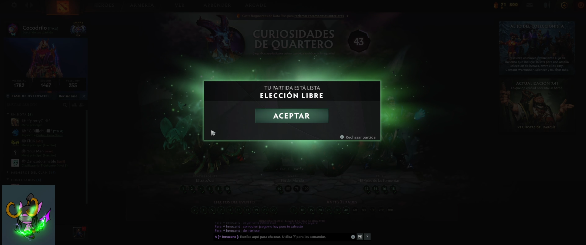
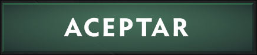

# autoclick

Rust CLI that watches one configured Wayland output, matches PNG templates with OpenCV, and injects clicks through a persistent output-bound Wayland virtual pointer.

## Warning

This program moves the mouse pointer and sends actual click events to your session. Run it only when you are ready for that behavior and understand what is visible on the selected monitor.

## Scope

This is a small Linux automation tool for one specific stack. It is not a general desktop automation framework and it does not claim broad portability.

Currently supported in practice:

- Linux
- Wayland
- a Wayland compositor advertising WLR virtual-pointer manager version 2 or later
- exactly one usable Wayland seat
- a configured connector whose Wayland output reports a completed Normal transform
- screenshots via `grim`
- `hyprctl monitors -j` only for configured-monitor enumeration

If your environment differs from that stack, assume it will need changes.

## Real-World Example

One real use case for this tool is automatically accepting a Dota 2 match when the acceptance dialog appears on screen.

Sometimes the match is ready while I am away from the keyboard, distracted, or doing something else for a moment. Missing that accept window is more than just annoying in Dota 2, because failing to accept can lead to penalties or queue restrictions. That was the original motivation for this project.

When the acceptance dialog appears:



The app watches the selected monitor and tries to detect a cropped template such as:



If that template appears on screen with enough confidence, the program sends an output-local click through the configured output's Wayland virtual pointer.

That was the original use case, but the same idea can also work for other similar situations where:

- a stable visual element appears on screen
- that element should trigger a click
- the UI is consistent enough for template matching to work reliably

## Clone And Setup

1. Install Rust.
2. Install system binaries in `PATH`: `hyprctl`, `grim`.
3. Run under the active Wayland session where the compositor advertises WLR virtual-pointer manager version 2 or later.
4. Ensure the configured connector resolves to a complete, Normal-transform Wayland output and exactly one usable seat is present.
5. Install OpenCV development libraries required by the Rust `opencv` crate.
6. Make sure the build environment can resolve OpenCV and Clang tooling. Package names are distro-specific.

This repository does not currently document distro-specific install commands because the required package names vary.

## First Use

Before the first run, prepare the config directory and put your PNG templates there.

Config path resolution:

- `$AUTOCLICK_CONFIG_PATH` if set
- otherwise `$XDG_CONFIG_HOME/autoclick/config.json`
- otherwise `~/.config/autoclick/config.json`

Templates are loaded from the sibling `templates/` directory next to that `config.json`.

Example:

```text
~/.config/autoclick/
├── config.json
└── templates/
    ├── accept_button.png
    └── ready_button.png
```

On first run, if the config file does not exist, the CLI prompts for:

- monitor
- scan interval in milliseconds
- global match threshold
- one or more template filenames

Important:

- template files must already exist in `templates/` before configuration is saved
- `target_template` must be a filename only
- absolute paths are rejected
- path segments such as `subdir/foo.png` or `../foo.png` are rejected

## Usage

```bash
cargo run
```

Logs go to `stderr`. By default the program stays quiet unless there is an error.

```bash
RUST_LOG=info cargo run
RUST_LOG=debug cargo run
```

The process keeps running until you press `q` and then `Enter`, or send `SIGINT` / `SIGTERM`.

## Config Shape

```json
{
  "monitor_name": "DP-1",
  "interval_ms": 250,
  "match_threshold": 0.95,
  "rules": [
    { "target_template": "accept_button.png" }
  ]
}
```

Current behavior:

- one global threshold
- one `target_template` per rule
- best match per template
- one temporary `capture.png` reused per scan cycle
- runtime failures are surfaced by stage (`capture`, `OpenCV match`, `click execution`)
- click injection requires the selected connector's Wayland virtual-pointer capability and fails closed when capability, seat, output, coordinates, or protocol delivery is invalid
- `hyprctl monitors -j` is used only to enumerate configured monitors; it is not an input, movement, timing, or cursor-confirmation path

## Development

```bash
cargo test
```

Known limitations:

- tightly coupled to Linux + Wayland + Hyprland
- no per-rule threshold
- no per-rule cooldown
- no per-rule click offsets
- no per-rule enable/disable flag
