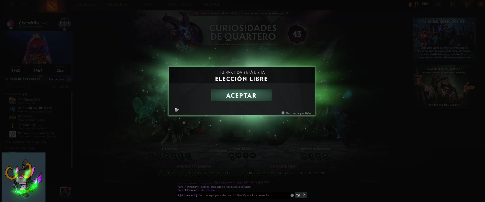
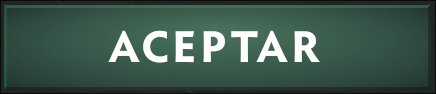

# autoclick

Rust CLI that watches one configured Wayland output, matches PNG templates with OpenCV, and injects clicks through a persistent output-bound Wayland virtual pointer.

## Warning

This program moves the mouse pointer and sends actual click events to your session. Run it only when you are ready for that behavior and understand what is visible on the selected monitor.

## Scope

This is a small Linux automation tool for one specific stack. It is not a general desktop automation framework and it does not claim broad portability.

Currently supported in practice:

- Linux
- Wayland
- a Wayland compositor advertising WLR virtual-pointer manager version 2 or later
- exactly one usable Wayland seat
- a configured connector whose Wayland output reports a completed Normal transform
- a Wayland compositor advertising `zwlr_screencopy_manager_v1` (wlr-screencopy) and `wl_shm`
- `hyprctl monitors -j` only for configured-monitor enumeration

If your environment differs from that stack, assume it will need changes.

## Real-World Example

One real use case for this tool is automatically accepting a Dota 2 match when the acceptance dialog appears on screen.

Sometimes the match is ready while I am away from the keyboard, distracted, or doing something else for a moment. Missing that accept window is more than just annoying in Dota 2, because failing to accept can lead to penalties or queue restrictions. That was the original motivation for this project.

When the acceptance dialog appears:



The app watches the selected monitor and tries to detect a cropped template such as:



If that template appears on screen with enough confidence, the program sends an output-local click through the configured output's Wayland virtual pointer.

That was the original use case, but the same idea can also work for other similar situations where:

- a stable visual element appears on screen
- that element should trigger a click
- the UI is consistent enough for template matching to work reliably

## Clone And Setup

1. Install Rust.
2. Install system binaries in `PATH`: `hyprctl`.
3. Run from the active Hyprland session so `hyprctl` and the Wayland client can access that session. In practice, preserve its `WAYLAND_DISPLAY`, `XDG_RUNTIME_DIR`, and Hyprland environment.
4. Ensure Hyprland advertises `zwlr_screencopy_manager_v1` plus `zwlr_virtual_pointer_manager_v1` version 2 or later, and permits the client to use them.
5. Ensure the configured connector resolves to exactly one complete, Normal-transform Wayland output and exactly one usable seat is present.
6. Install OpenCV development libraries required by the Rust `opencv` crate.
7. Make sure the build environment can resolve OpenCV and Clang tooling. Package names are distro-specific.

This repository does not currently document distro-specific install commands because the required package names vary.

## Install

`install.sh` builds the release binary as your user and copies it with root rights to `/usr/local/bin/autoclick`:

```bash
./install.sh              # asks for your sudo password only for the copy
sudo ./install.sh         # also works: the build still runs as you, not as root
./install.sh --uninstall
```

Set `BIN_DIR` to install somewhere else, for example `BIN_DIR=/usr/bin ./install.sh`. The build never runs as root, so `target/` stays owned by you. Running it from a root login, without `sudo`, is refused. It warns when another `autoclick` comes earlier in `PATH`, and when `hyprctl` is missing.

## First Use

Before the first run, prepare the config directory and put your PNG templates there.

Config path resolution:

- `$AUTOCLICK_CONFIG_PATH` if set
- otherwise `$XDG_CONFIG_HOME/autoclick/config.json`
- otherwise `~/.config/autoclick/config.json`

Templates are loaded from the sibling `templates/` directory next to that `config.json`.

Example:

```text
~/.config/autoclick/
├── config.json
└── templates/
    ├── accept_button.png
    └── ready_button.png
```

On first run, if the config file does not exist, the CLI prompts for:

- monitor
- scan interval in milliseconds
- global match threshold
- one or more template filenames

Important:

- template files must already exist in `templates/` before configuration is saved
- `target_template` must be a filename only
- absolute paths are rejected
- path segments such as `subdir/foo.png` or `../foo.png` are rejected

## Usage

```bash
cargo run
```

Logs go to `stderr`, each line starting with its UTC timestamp. By default only
warnings and errors are shown, so every skipped monitor cycle is reported with
its stage and cause.

```bash
RUST_LOG=info cargo run
RUST_LOG=debug cargo run
```

The process keeps running until you press `q` and then `Enter`, or send `SIGINT` / `SIGTERM`
(for example with Ctrl+C). The first signal asks the monitor loop to stop after the
current cycle, which every Wayland wait bounds (see the deadlines under Current
behavior). A second signal exits immediately with status 130, without waiting
for the cycle to finish.

## Config Shape

```json
{
  "version": 1,
  "monitor_name": "DP-1",
  "interval_ms": 250,
  "match_threshold": 0.95,
  "rules": [
    { "target_template": "accept_button.png" }
  ]
}
```

`version` is optional when reading: a file without it is treated as version 1.
Every save writes it, so a config produced by a newer build is reported as a
version mismatch instead of an unrelated unknown-field error.

Current behavior:

- one global threshold
- one `target_template` per rule
- each `target_template` may appear in only one rule (compared after trimming surrounding whitespace); loading or saving a config that repeats one fails with an error naming the duplicate and both rule indexes, a saved config with a repeat is treated as incompatible and triggers reconfiguration, and the interactive setup refuses a template already entered and asks again
- best match per template
- every best match is checked in color before it can be clicked: grayscale matching alone ignores brightness, contrast and hue, so a dimmed, disabled, gray or recolored copy of a button scores like the real one. The matched screen region's mean blue, green and red must each stay within 40 (out of 255) of the template's, and its luminance contrast within 0.75–1.33 times the template's; otherwise that template counts as unmatched for the cycle, with no fallback to a weaker candidate. A hover highlight (the button about 10–15% lighter while the virtual pointer rests on it after a click) still passes. Template colors are measured once at startup, and each cycle samples only the matched regions straight from the captured frame; `RUST_LOG=debug` logs the measured differences of every rejected match
- a template that stays unclickable for 12 consecutive cycles (one minute at a 5-second interval), because it keeps matching in grayscale but failing the color check or is larger than the captured frame and cannot be scored, is reported with a warning, `template <name> keeps matching in grayscale but failing the color check` (with its score, largest channel difference and contrast ratio) or `template <name> is larger than the captured frame and cannot be matched` (with both sizes). The warning repeats at most once a minute while the streak lasts, and the streak ends as soon as the template is accepted or simply not found
- at most one click per cycle: every template is still scanned, but only one matched rule is clicked, and the other matched rules wait for the next cycle's fresh capture, so no click aims at a screen the previous click already changed
- matched rules take turns: the next cycle searches the rules after the one it just clicked, wrapping around, so that rule goes last; when it is the only match it is clicked again, and a target that stays on screen after its click cannot keep the other rules from being clicked. A cycle that clicks nothing or fails, and the first cycle after startup, follow config order
- one persistent wlr-screencopy connection captures the configured output, without the cursor, into a reused shared-memory buffer; each frame is converted straight to grayscale and handed to the matcher, with no external process, image encoding, or disk I/O
- templates of a single uniform color are rejected during startup: normalized matching scores every position of every screenshot at 1.0 against them, so the runtime would click the top-left corner forever
- runtime failures are surfaced by stage (`capture`, `OpenCV match`, `click execution`)
- a failed capture or match skips that cycle with a warning, and any successful cycle resets the count of consecutive failures
- the loop never exits over screen or compositor trouble. It enters a waiting state instead, at once on a disconnect or a stall, or after 5 consecutive failed cycles of any other kind, such as frames that time out while the output is powered off, an unsupported frame format, a Wayland protocol error, or a failed match:
  - a disconnect is the configured output being unplugged (its `wl_output` global is removed) or a Wayland connection failing on I/O, such as the compositor closing the socket; the next capture fails at once, with no 2-second wait and no frame from the removed output, and the virtual pointer reports the same when a click finds its output gone. A stall is a click whose compositor round trip is not answered within its deadline. A protocol error is not a disconnect: it counts as an ordinary failure
  - entering the state logs one warning: `output <connector> disconnected; waiting for it to return`, `output <connector> stopped answering; waiting for it to return`, or `output <connector> failed 5 consecutive cycles; waiting for it to recover`, each with its cause
  - every attempt drops both the screencopy client and the virtual pointer, connects both again by connector name, and runs one cycle on them. The first attempt comes after 1 second, and each failed attempt, whether connecting or that cycle failed, doubles the wait up to 10 seconds; a reconnect alone does not reset it, so a failure that repeats on every attempt is retried no more than once every 10 seconds
  - only a successful cycle ends the state. It logs `monitoring of output <connector> resumed` as a warning, so the default log level shows when the outage ended, resets the wait to 1 second and the failure count, and normal cycles resume with the rule turns starting again in config order
  - while waiting, `output <connector> is still unavailable; waiting for it to return` is repeated about every 60 seconds with the time waited and the last error; each failed attempt is logged at `RUST_LOG=debug`. `q`, SIGINT and SIGTERM stop the process while it waits; if a reconnect attempt is in progress against a compositor that does not answer, the first signal takes effect when that attempt times out (up to about 10 seconds: a 5-second deadline for each of the two connections), and a second signal exits immediately
- a click failure stops the loop immediately with an error, unless it is a disconnect or a stall: an unsupported output transform, or a lost seat or virtual-pointer manager, is configuration drift that no wait repairs
- every Wayland wait has a deadline, so a compositor that stops answering cannot hang the process: a screencopy frame not finished within 2 seconds fails that capture; each round trip of a click (the check on the way in and the barrier on the way out) fails within 2 seconds as a stall; connecting either client fails within 5 seconds, which during the waiting state counts as a failed attempt
- one persistent, output-bound Wayland virtual pointer sends absolute motion, left-button press, and left-button release directly from the process
- each click is a synchronous framed transaction on one Wayland connection: it validates once on the way in, queues motion, press and release, and flushes them in a single write closed by one protocol round trip, so press and release reach the compositor together
- invalidation or delivery failures stop the transaction instead of falling back to another input path
- click injection fails closed when capability, seat, output, coordinates, or protocol delivery is invalid
- `hyprctl monitors -j` is used only to enumerate configured monitors; it is not an input, movement, timing, or cursor-confirmation path

## Match Threshold

`match_threshold` is compared against a `TM_CCOEFF_NORMED` score. That mode
subtracts the mean of both images before correlating, so a flat bright region of
the screen cannot score high against an unrelated template.

The number is not portable across matching modes. A threshold tuned against a
different mode will not mean the same thing here, and the failure is silent: the
template simply stops matching and no click happens, with no error. Run with
`RUST_LOG=debug` to see the best score of every template on every cycle,
including the ones that were rejected, and pick a threshold from what you
actually observe:

```
DEBUG OpenCV matcher finished template scan target_template=accept_button.png score=0.87 threshold=0.95 candidates=0
```

## Runtime Architecture

The runtime uses three session-facing APIs:

- `hyprctl monitors -j` discovers Hyprland monitor connector names and geometry for configuration
- `zwlr_screencopy_manager_v1` copies the selected output into a `wl_shm` buffer in-process for OpenCV template matching
- `zwlr_virtual_pointer_v1` performs output-local pointer motion and clicking directly over Wayland

Both Wayland clients need a wlroots-family compositor such as Hyprland or Sway; GNOME and KDE do not offer these protocols. The screencopy connection is opened once during startup, after the configured monitor is resolved, and startup fails with the connector named if the compositor does not offer screencopy for it.

The virtual pointer is created during startup and stays bound to the selected Wayland output. If the selected manager, seat, or output becomes invalid, the backend reports an error rather than rebinding or retrying a click. A removed output, a lost or stalled Wayland connection, and repeated capture or match failures are the exceptions the runtime recovers from: it waits, replacing both Wayland clients with new ones, until a cycle on them succeeds (see Current behavior). A missing output at startup is still a startup error.

## Development

```bash
cargo test
```

The test harness is rooted at `tests/unit.rs` and `tests/integration.rs`. Component tests live under `tests/unit/`, including the Wayland protocol and transaction coverage in `tests/unit/wayland_pointer_tests.rs` and `tests/unit/screencopy_tests.rs`; they use an in-process test compositor/socket pair and do not inject input into the active desktop session.

One ignored test captures a real output from the active session to check screencopy and its timing. It only reads pixels and never creates a pointer or clicks:

```bash
AUTOCLICK_LIVE_OUTPUT=HDMI-A-1 AUTOCLICK_LIVE_PNG=/tmp/live.png \
    cargo test --test unit live_capture_of_configured_output -- --ignored --nocapture
```

Known limitations:

- tightly coupled to Linux + Wayland + Hyprland
- no per-rule threshold
- no per-rule cooldown
- no per-rule click offsets
- no per-rule enable/disable flag
